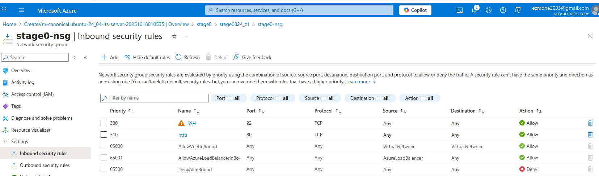
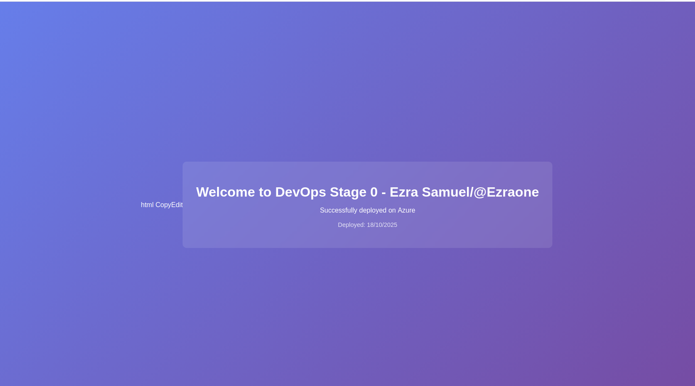

# 🚀 Deploying a Simple NGINX Server to Azure

This guide walks you through deploying a basic HTML website to Microsoft Azure using NGINX server.

## 🛠 Prerequisites

Before you begin, make sure you have:

- An active [Azure account](https://azure.microsoft.com/)
- [Azure CLI](https://learn.microsoft.com/en-us/cli/azure/install-azure-cli) installed
- Git installed (optional, for version control)

## ☁️ Step-by-Step Deployment

### Setting Up Azure Virtual Machine

- Create a Virtual Machine in Azure using the linl [Azure Virtual Machine](https://learn.microsoft.com/en-us/azure/virtual-machines/windows/quick-create-portal)

- Download the .pem file to a safe locartion

- Enable inbound rule for http




### connect to the Virtual Machine via SSH

- Make the .pem file executable

```bash
chmod 500 /home/ezra/Downloads/<file>.pem
```

- Connect to the Virtual Machine

```bash
ssh -i <file>.pem azureuser@<VM IP>
```

### Installing and Congiguring NGINX on the Virtual Machine

- Update System Packages

```bash
sudo apt update && sudo apt upgrade -y
```

- Installing NGINX

```bash
sudo apt install nginx -y
```

- Verify NGINX Status

```bash
sudo systemctl status nginx
```

- Create a Custom HTML File and paste the content of `index.html` file in it.

```bash
sudo nano /var/www/html/index.html
```
- Customize the Web Page (as seen in the section of `index.html` below)

```bash
  <div class="container">
    <h1>Welcome to DevOps Stage 0 - Ezra Samuel/@Ezraone</h1>
    <p>Successfully deployed on Azure</p>
    <p class="timestamp">Deployed: 18/10/2025</p>
  </div>
  ```

  ### Test Your Static Site

  ```bash
  http://<your-vm-ip-address>
  ```



#### You have successfully deployed a static site in Azure.
